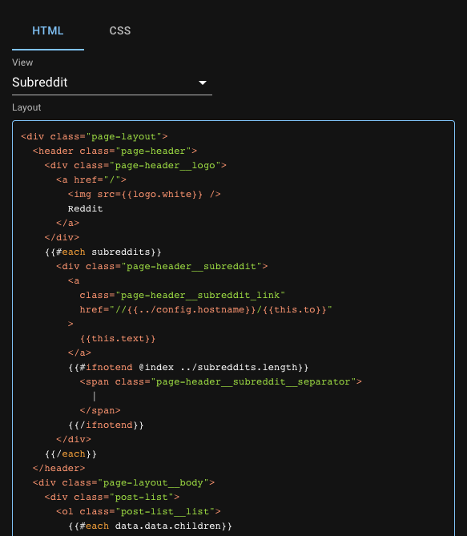

# Reddit JSON UI

A browser extension that stylizes Reddit pages by fetching their associated JSON
(if available) and wrapping the page in a fully-customized style you provide.

⚠️ This is still very much a work in progress. It is not yet available on any
extension store but may be installed locally by following the "Local
Development" section below. The API may change at any time so it's a good idea
to keep backups of your templates and styles.

## What?

Reddit offers a public JSON API that is accessible by appending `.json` to the
end of a lot of URLs. Check out an example:
https://old.reddit.com/r/popular.json. The extension works by fetching the
current page's JSON and applying your own HTML and CSS to provide a customized
user experience.

|                         Theme                          |                  Editor                  |
| :----------------------------------------------------: | :--------------------------------------: |
|  |  |

# Creating your first theme

A guide to creating themes from scratch can be found on the Wiki page
[Your First Theme](https://github.com/dan-lovelace/reddit-json-ui/wiki/Your-First-Theme).

# Template API

API documentation can be found on the Wiki page
[Template API](https://github.com/dan-lovelace/reddit-json-ui/wiki/Template-API).

# Local Development

## Requirements

| Name                                                   | Version  |
| ------------------------------------------------------ | -------- |
| [NodeJS](https://nodejs.org/en/blog/release/v16.16.0/) | v16      |
| [Yarn](https://yarnpkg.com/)                           | v1.22.19 |

## 1. Install

```shell
$ git clone https://github.com/dan-lovelace/reddit-json-ui.git
$ cd reddit-json-ui
$ yarn
```

## 2. Build

Once complete, build assets can be located in the `dist` directory at the
project root. Keep this in mind when adding the unpacked version to your browser
for testing.

### Build commands

| Command        | Description                                                                      |
| -------------- | -------------------------------------------------------------------------------- |
| `yarn start`   | Creates a Manifest V3 build and starts file watchers on all packages<sup>+</sup> |
| `yarn build 2` | Creates a build using Manifest V2                                                |
| `yarn build 3` | Creates a build using Manifest V3                                                |

<sup>+</sup> If you'd instead like to develop using V2, you'll need to copy the
contents of `assets/manifest-v2.json` into
`packages/content/public/manifest.json` and run a clean build.

## 3. Add browser extension

After starting or building, the extension's distribution is located in the
`dist` directory at the root of the project. Add the unpacked assets to your
browser of choice. For now, Manifest V3 builds are only supported by Chrome.

Chrome: https://developer.chrome.com/docs/extensions/mv3/getstarted/#unpacked

Firefox:
https://developer.mozilla.org/en-US/docs/Mozilla/Add-ons/WebExtensions/Your_first_WebExtension#installing

## Tips

### Clearing storage

It can be helpful when making code changes to delete all storage items and start
from scratch. To do that, inspect the background script in the browser's
extension UI and run the following command in the console:

```js
chrome.storage.sync.get((result) => {
  Object.keys(result).forEach((key) => chrome.storage.sync.remove(key));
});
```

# Creating & publishing versions

To create and package a new version for publishing:

1. Increment the version in `package.json` - Use
   [Semantic Versioning](https://semver.org/) standards
1. Run `yarn package <manifest version>` - Target either Manifest version `2` or
   `3` (i.e. `yarn package 3`)
1. Inspect the output zip file in the `versions` directory to make sure
   everything looks right

Log in to either the [Chrome Web Store](https://chrome.google.com/webstore/)
(Manifest V3) or [Firefox Addon Hub](https://addons.mozilla.org/en-US/firefox/)
(Manifest V2), upload the new version and submit for review.

When complete, create a new release in GitHub with a tag that matches the new
version (i.e. `v0.0.1`). Highlight changes under a "Changes" heading as seen in
previous releases.
